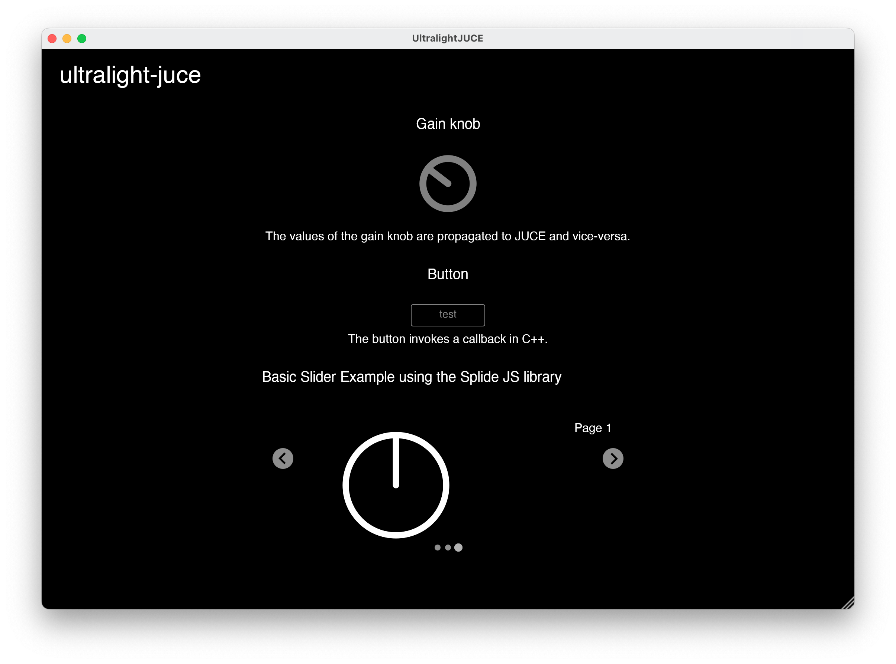
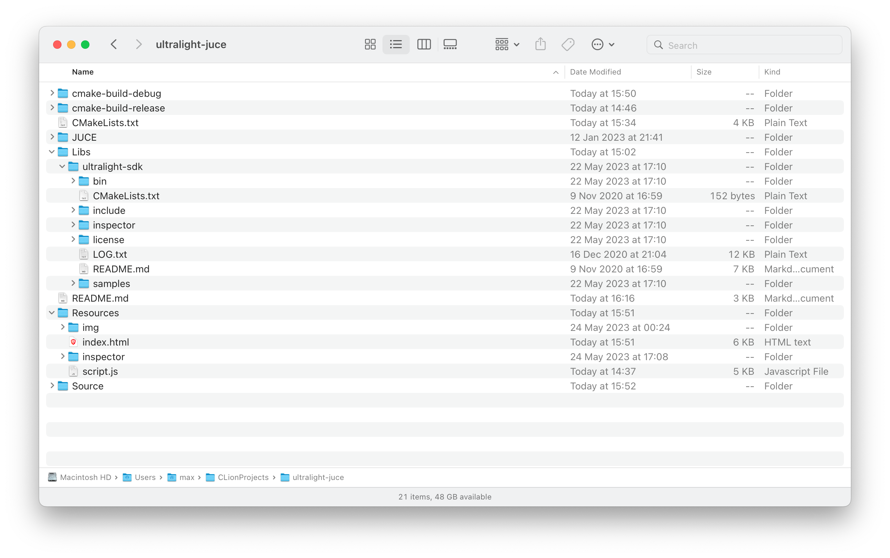

# juce-ultralight 🍊⚡
---

This repository contains the source code for the `juce-ultralight` GUI framework.
This framework integrates the [Ultralight](https://ultralig.ht/) HTML renderer with JUCE, allowing you to embed web content in your JUCE application.
It enables JUCE components that are designed, rendered and scripted using HTML, CSS and JavaScript.
I made this framework because I have extensively worked with JUCE, but have found its GUI functionality limiting/tedious at times. HTML/CSS/JS make it easy to create appealing and interactive user interfaces.
The goal of this framework is not to replace the existing JUCE GUI capabilities, but to extend them.
Ideally, this will evolve into a toolset that allows more people to create beautiful JUCE appliations and plugins.

Some of the key features are:
- **Lightweight**: The Ultralight library is small and fast, and has minimal dependencies. Ultralight is based on WebKit and supports most HTML/CSS features out of the box.
- **Cross-platform**: Supports Windows, macOS and Linux.
- **Side-by-side rendering**: The framework allows you to render JUCE components and web content side-by-side, or on top of each other. 
- **C++/JS interoperation**: Includes methods for calling C++ functions from JavaScript and vice versa.
- **State-management**: Includes methods for handling application state sharing between C++ and JavaScript, based on the JUCE AudioProcessorValueTreeState.
- **Hot-reloading**: Your HTML/CSS/JS files are automatically reloaded when they change, so you can see your changes immediately, while your plugin/app is running.
- **JavaScript library support**: Through Ultralight the framework includes support for most JavaScript libraries, e.g., [jQuery](https://jquery.com/) and [Bootstrap](https://getbootstrap.com/).
- **Adaptable**: The framework is designed to be easily extended and adapted to your needs.

As of now, the framework is still in an early stage of development. I am very happy to receive feedback and contributions, so please feel free to open an issue or submit a pull request! 

## Getting started
The project is based on JUCE and built with CMake. To get up and running, follow these steps:
1. Make sure you have [CMake](https://cmake.org/) (minimum v3.12) installed
2. Clone this repository
3. Download [JUCE](https://juce.com/get-juce/download) and copy the JUCE folder to the root of the project
4. Download the [Ultralight SDK](https://github.com/ultralight-ux/Ultralight/releases) and copy the `ultralight-sdk` folder to the `Libs` folder (see below for a screenshot of the folder structure)
5. Open `Source/Config.h` and
   1. Set `JS_RESOURCES_PATH` to the path of the `Resources` folder in the project root, e.g. `.../juce-ultralight-main/Resources`
   2. Set `ULTRALIGHT_RESOURCES_PATH` to the path of the `resources` folder in the `Libs/ultralight-sdk/bin` directory, e.g. `.../juce-ultralight-main/Libs/ultralight-sdk/bin/resources`
6. Copy the `Libs/ultralight-sdk/inspector` folder to the `Resources` folder in the project root, e.g. `.../juce-ultralight-main/Resources
7. Build the project using CMake in your favourite IDE or via terminal, e.g. by
   1. Make sure you have a CMake generator installed, e.g. [Ninja](https://ninja-build.org/) on macOS or [Visual Studio](https://visualstudio.microsoft.com/) on Windows
   2. Open the terminal and navigate to the project root
   3. Create a build directory, e.g. `mkdir build`
   4. Navigate to the build directory, e.g. `cd build`
   5. Generate the build files, e.g. 
      1. macOS: `cmake -DCMAKE_BUILD_TYPE=Debug -DCMAKE_MAKE_PROGRAM=/path/to/ninja -G Ninja -S /path/to/project/root -B cmake-build-debug`
      2. Windows: `cmake -DCMAKE_BUILD_TYPE=Debug -G "Visual Studio 17 2022" -S /path/to/project/root -B cmake-build-debug`
   6. Build the application/plugin using CMake, e.g. `cmake --build cmake-build-debug --target UltralightJUCE_Standalone -j 10`
8. Find the built application/plugin in the `cmake-build-xxx/UltralightJUCE_artefacts/xxx` directory

The source code of this project includes a sample application in the form of a JUCE audio plugin. 
Familiarise yourself with the `PluginProcessor`, `GUIMainComponent` and `JSInteropBase` classes to further understand how 
the framework operates and how to use it in your own project.
For examples of C++/JS interoperation, see the `JSInteropExample` class, as well as the HTML/JS files in the `Resources` folder. 

### Screenshot of the folder structure

## Todo
- [ ] Documentation
- [ ] Tests
- [ ] More examples
- [ ] Automatic handling of more complex datatypes for C++/JS interop
- [ ] JS debugging (this is currently not supported by Ultralight)
- [ ] Prettier header picture

If you would like to contribute, please feel free to open an issue or submit a pull request!

## Hints for the example application
- Once the application is running, you can show/hide the developer tools by pressing the `I` key on your keyboard.

## Acknowledgements
- Julian Storer for JUCE ❤️
- Adam Simmons for Ultralight 🔥

## License
The code in this project is licensed under the LGPL-3.0 license.
Please note that some components of the Ultralight SDK are licensed under less permissive licenses, see the [here](https://github.com/ultralight-ux/Ultralight#architecture) for more details.

---
🍊⚡